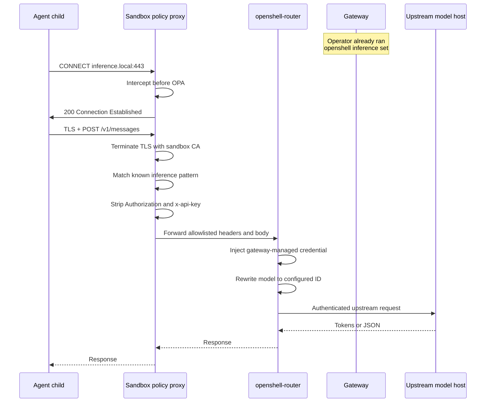

This page is a short teaching wiki. It walks one model call from the agent process to the upstream provider, names the code that implements each hop, and contrasts that path with a desktop cowork-style agent that runs on the user's machine.

If you already know the component names, start at [How a Model Call Travels](#how-a-model-call-travels). If you are new to OpenShell, start at [The Trust Split](#the-trust-split).

## The Trust Split

OpenShell does not treat the model, the agent, and the user's host as one trusted process. It splits them into three roles with different privileges.

| Role | What it is | What it can see |
|---|---|---|
| User and gateway | The control plane you talk to with the CLI, SDK, or TUI. | Sandbox state, policy, provider records, and inference config. It stores the real model API keys. |
| Supervisor | The privileged process inside the sandbox workload. | Policy, the local proxy, and gateway-delivered secrets. It launches the agent as a restricted child. |
| Agent | The coding agent or script (Claude Code, OpenCode, Codex, or your own process). | Only the files, network destinations, and placeholder credentials that policy allows. It never receives the provider API key. |

The model is not inside the sandbox. The agent calls `https://inference.local`. The sandbox proxy intercepts that host before ordinary network policy runs, strips caller-supplied credentials, and forwards a known inference shape through `openshell-router` using a route bundle the supervisor fetched from the gateway.

That split is the security claim. A desktop cowork-style agent usually runs as the user on the host, holds the model key in its own environment, and can read whatever the user can read. OpenShell inverts that. The agent is an unprivileged child. The key stays on the gateway. Ordinary egress is deny-by-default.

## How a Model Call Travels

A typical agent call looks like an ordinary HTTPS request. Inside the sandbox it is not ordinary egress.



The steps below are the ones that matter for security.

1. You create a provider and point `inference.local` at it with `openshell inference set`. The gateway stores `provider_name`, `model_id`, and an optional timeout. It does not copy the API key into the sandbox.
2. The supervisor starts, applies filesystem and process isolation, then opens a session back to the gateway. It pulls the inference bundle through `GetInferenceBundle`. That bundle has the upstream URL, protocol, auth style, and credential material the router needs.
3. The agent starts as a non-root child. Its environment can contain a placeholder such as `ANTHROPIC_API_KEY=unused` and `ANTHROPIC_BASE_URL=https://inference.local`. The placeholder is not the provider key.
4. The agent dials `inference.local:443`. A dedicated Linux network namespace forces that TCP connection through the local CONNECT proxy. Even if the process ignores `HTTPS_PROXY`, it still hits the proxy.
5. The proxy recognizes `inference.local` on port 443 and handles the connection before OPA network policy. Direct calls to `api.anthropic.com` or `api.openai.com` do not get this path. They are ordinary egress and need an explicit `network_policies` allow rule.
6. The proxy terminates TLS with a per-sandbox ephemeral CA, parses the HTTP request, and matches it against known patterns such as `POST /v1/messages` or `POST /v1/chat/completions`. Anything that is not a known inference shape is denied, including a later request on the same keep-alive socket.
7. `openshell-router` drops `Authorization` and `x-api-key`, forwards only a per-provider header allowlist, injects the real credential, and rewrites the model ID to the gateway-configured value. The agent cannot pick a different backend or sneak its own key upstream.

After that, the agent only sees the model response. It does not see the upstream host credential.

## What the Agent Cannot Do on This Path

The interception path is narrow on purpose. The following requests fail closed.

| Agent attempt | What OpenShell does |
|---|---|
| Send a real or stolen `Authorization` header to `inference.local` | The router strips `authorization` and `x-api-key` before the upstream call. |
| Call `/admin/config` or another non-inference path on `inference.local` | The proxy denies the request and closes the connection. |
| Reuse a keep-alive socket that already carried a routed inference request for a non-inference request | The proxy denies that follow-up request and closes the socket. |
| Add the provider hostname to `network_policies` and call it directly | That traffic is no longer the managed path. The agent would need its own key, which OpenShell does not inject. Do not allow provider hosts this way. |
| Change the configured model in the request body | The router rewrites the model to the gateway-configured ID. |

Use `inference.local` when the goal is managed inference. Use `network_policies` only for non-inference APIs the agent must reach, such as GitHub or a package registry.

## Isolation Around the Model Call

A stolen prompt or a prompt-injected agent is still a process. OpenShell assumes that process will try to read extra files, reach extra hosts, and escalate. The model path is one control. The layers around it are the others.

| Layer | What it stops | When it is applied |
|---|---|---|
| Process | Root, extra capabilities, and dangerous syscalls such as `ptrace`, `bpf`, and `mount`. | At child start. Recreate the sandbox to change it. |
| Filesystem (Landlock) | Reads and writes outside declared paths, including host SSH keys and cloud credential files that were never mounted in. | At child start. Recreate the sandbox to change it. |
| Network namespace | Direct sockets that skip the proxy. | Always on in proxy mode. |
| Policy proxy plus OPA | Outbound connections that are not in `network_policies`, including calls by the wrong binary. | Live. You can update policy without recreating the sandbox. |
| SSRF checks | Connections to loopback, link-local, and cloud metadata addresses after DNS resolution. | On every allowed connect. |
| Credential injection | Putting long-lived provider keys in the agent environment. | Gateway-to-supervisor delivery, then placeholder rewrite on inspected HTTP. |
| OCSF logs | Silent policy changes and silent denies. Network, HTTP, process, and inference events are structured and exportable. | On each observable decision. |

Static layers (process and filesystem) are locked at start so a running agent cannot widen its own disk or identity. Dynamic layers (network and inference) can refresh over the supervisor session so an operator can tighten egress without destroying the workspace.

## How This Differs from a Desktop Cowork Agent

A desktop cowork-style agent (Claude Cowork and similar host-local assistants) is usually one program on the user's machine. It can see the user's files, hold the model API key, and make outbound HTTPS calls as the user. The safety model is mostly product policy, user confirmation, and the model's own refusal behavior.

OpenShell uses a different trust model. The table below compares the common failure modes, not product brand names.

| Failure mode | Desktop cowork-style agent | OpenShell sandbox |
|---|---|---|
| Agent reads host secrets | The process often runs as the user, so `~/.ssh`, `~/.aws`, and browser cookies are reachable unless the product adds its own filter. | Landlock allows only declared paths. Host secret stores are not in the sandbox unless you mount them. |
| Agent exfiltrates a repo | Outbound HTTPS is usually open so the model provider works. Any other host is then reachable too. | Egress is deny-by-default. Each host, port, and calling binary needs a policy rule. Unlisted destinations are blocked and can require operator approval. |
| Agent steals the model key | The key is commonly an environment variable or local config file inside the same process that runs tools. | The gateway stores the key. The agent sees a placeholder. The router injects the real credential after interception. |
| Agent picks an unapproved model host | The same open HTTPS path can reach any provider the key or a hardcoded key allows. | `inference.local` is the managed path. Direct provider hosts are ordinary egress and stay denied unless you add them on purpose. |
| Agent escapes the workspace | A local process can spawn helpers, follow symlinks, or use host tools. | The child drops privileges, loses the capability bounding set, and hits seccomp before user code runs. |
| Operator reconstructs what happened | Logs are often chat transcripts plus host process logs. | Sandbox decisions emit OCSF events for allows, denies, process start, and model calls. |

OpenShell does not make the model itself safer. A prompt can still ask the agent to do something harmful inside the sandbox. The isolation goal is a smaller blast radius. The agent can damage only the files you gave it, reach only the hosts you allowed, and spend only the inference credential the gateway injected on the far side of the proxy.

<Note>
This comparison describes a common desktop-agent trust model. Individual cowork products add their own confirmations, allowlists, or virtualization. OpenShell's difference is that those controls are the runtime. They are kernel and proxy enforcement, not an optional wrapper around a host process.
</Note>

## Code Map

Read these files in order if you want the implementation, not just the story.

| Hop | Path | What to look for |
|---|---|---|
| User configures the route | `crates/openshell-cli/` plus `crates/openshell-server/src/inference.rs` | `openshell inference set` writes an `InferenceRoute`. The gateway stores provider name, model, and timeout only. |
| Supervisor fetches the bundle | `crates/openshell-server/src/inference.rs` (`GetInferenceBundle`) | The sandbox-authenticated RPC that resolves URLs, protocols, and credentials from the provider record. |
| Agent is restricted | `crates/openshell-sandbox/` and `architecture/sandbox.md` | Privilege drop, Landlock, seccomp, and the child vs supervisor split. |
| CONNECT hits inference | `crates/openshell-supervisor-network/src/proxy.rs` | `INFERENCE_LOCAL_HOST` is handled before OPA. `handle_inference_interception` terminates TLS. |
| Pattern match | `crates/openshell-supervisor-network/src/l7/inference.rs` | `default_patterns()` lists the allowed methods and paths. Unknown shapes are denied. |
| Credential strip and inject | `crates/openshell-router/src/backend.rs` | `sanitize_request_headers` and `should_strip_request_header` drop `authorization` and `x-api-key`. |
| Route shaping | `crates/openshell-router/src/lib.rs` and `crates/openshell-router/src/config.rs` | Protocol match, model rewrite, and per-provider header allowlists. |
| Policy for everything else | `crates/openshell-policy/` and `architecture/security-policy.md` | Filesystem, process, and ordinary network rules. Inference is not an OPA allow rule. |
| Audit trail | `crates/openshell-ocsf/` | Model calls emit API Activity with an `ai_operation` profile. Denies emit Network Activity. |

A runnable walkthrough lives in `examples/local-inference/`. That example sends traffic to `https://inference.local` and shows the intercept-and-reroute path without teaching the agent a host API key.

## Try the Path

Configure a provider, point `inference.local` at it, then call the local endpoint from a sandbox.

```shell
openshell provider create --name nvidia-prod --type nvidia --from-existing
openshell inference set --provider nvidia-prod --model nvidia/nemotron-3-nano-30b-a3b
openshell sandbox create -- claude
```

Inside the sandbox, the agent or a script should target `https://inference.local`, not the public provider hostname. For copy-paste client examples, refer to [Inference Routing](/sandboxes/inference-routing#use-the-local-endpoint-from-a-sandbox).

## Next Steps

Use the pages below when you want the operational details behind this map.

- [How OpenShell Works](/about/how-it-works) for the gateway, supervisor, and driver boundaries.
- [Inference Routing](/sandboxes/inference-routing) to configure `inference.local`.
- [Security Best Practices](/security/best-practices) for every control, its default, and the risk of relaxing it.
- [Customize Sandbox Policies](/sandboxes/policies) to allow non-inference egress.
- [Supported Agents](/about/supported-agents) for which agents can use this path out of the box.
